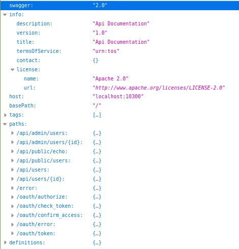
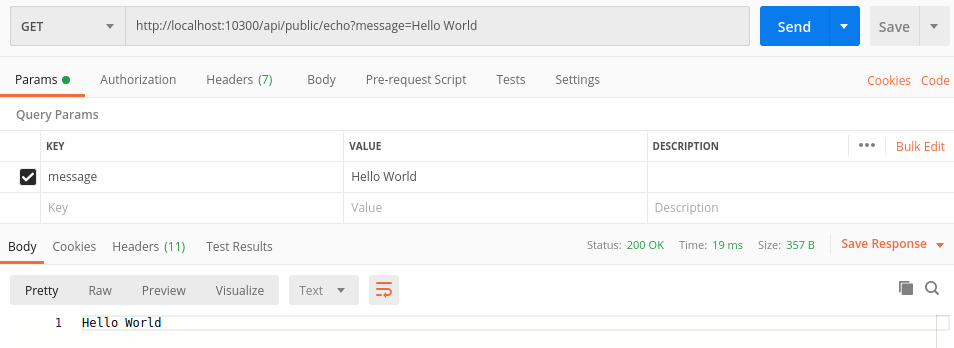
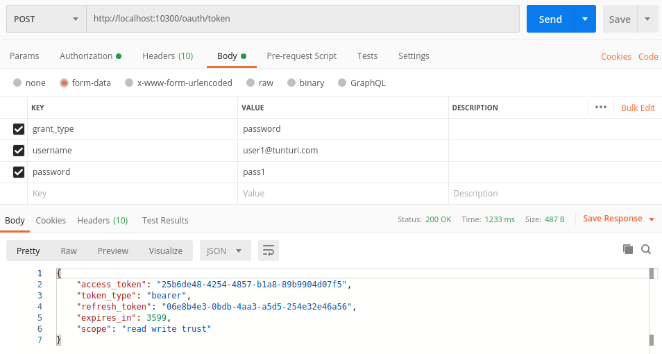
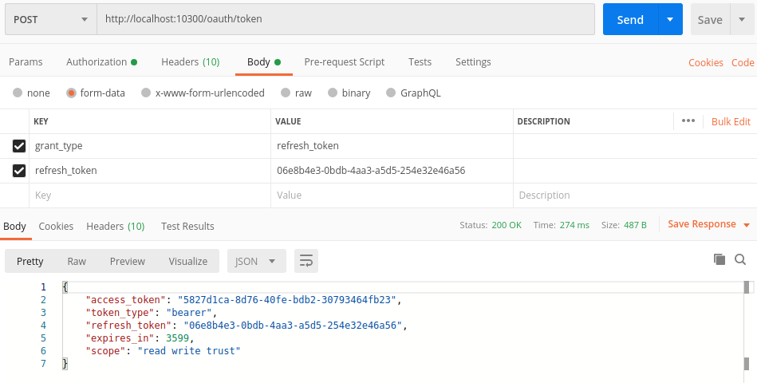
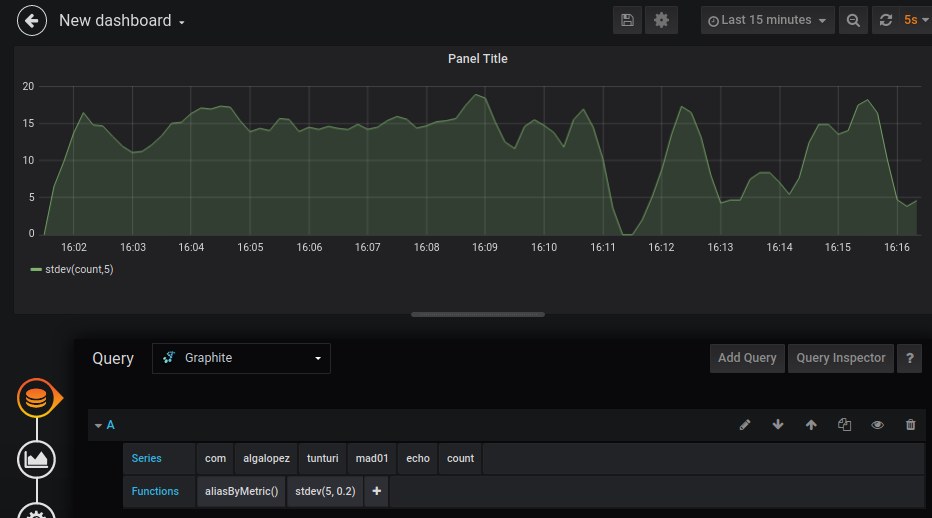

# Playing with the app

## Deploy tunturi

In this example we will deploy the app locally, using the scripts provided.
Checkout the [deployment readme](../deploy/README.md) for more information.

1. ```deploy-local-sh```
2. ```migrate-database.sh```

This deployment provides a set of users (one being an admin) to start testing without the need for creating new ones:
``` json
[
    {"username":"user1@tunturi.com", "password":"pass1"},
    {"username":"user2@tunturi.com", "password":"pass2"},
    {"username":"user3@tunturi.com", "password":"pass3"},
    {"username":"user4@tunturi.com", "password":"pass4"},
    {"username":"admin@tunturi.com", "password":"pass5"}
]
```

## Api

This API is divided into public, protected, private and oauth endpoints

- Public: Everyone has access as anonymous users
- Protected: Only registered users has access, but usually they will be granted access only to their own resources
- Private: Only admins has access 
- Oauth: Everyone has access

### Swagger

To see all the available endpoints and the supported methods, just check out the swagger api

This is accessible via the following url: http://localhost:10300/api/public/swagger



### Echo

This is the simplest api. Just a public api that returns the same text as received as a query parameter.
The goal is to use it as PoC in TunturiDroid or in other projects.

Check it out sending a GET request as the following:

```
Request:
> curl http://localhost:10300/api/public/echo?message=Hello+World

Response:
> Hello World
```

### Oauth

For authorization, we are using oauth2 password grant along with client credentials. 

For now, client credentials have hardcoded values and scopes. The goal is that trusted clients can have different scopes assigned. 

To get or refresh a token, you must add the in a basic authorization header with the values:
 - username: client
 - password: secret
 
**Access token:**

To be able to use any protected or private endpoint, you will need to ask for an access token.

Url: http://localhost:10300/oauth/token



**Refresh token:**

A refresh token will be also provided with a longer lifespan for refreshing expired access tokens.

Url: http://localhost:10300/oauth/token



Once you have a valid token, you can use it to access your resources, or everyone's resources if you are an admin

### User

...

## Metrics

To monitor the endpoints, you can access the Grafana visualization tool:

Url: http://localhost:3000/

Note: to add the Graphite database, use Graphite's server name inside the deployment docker-compose 

Graphite url: http://graphite



## Stop tunturi

3. ```unDeploy-local.sh``` (when finished)
